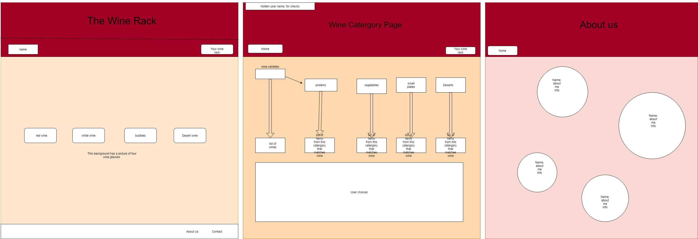
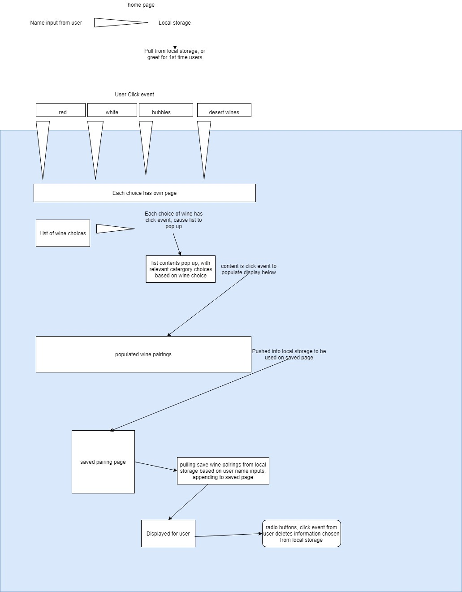

# thewinerack

An application that helps you pair wine with food at home!

## Developers

Audrena Vacirca, Nathan Cox, Simon Panek, Ameilia Valdes

## Description

A simple application to access the advice of a professional sommelier at any time of day.

[Trello Board](https://trello.com/b/V2J1740R/the-wine-rack)

## Contributions and Sources

### Wine Glass Image on Homepage

[Photographer Maksym Kaharlytskyi](https://unsplash.com/@qwitka?utm_source=unsplash&utm_medium=referral&utm_content=creditCopyText)

### CSS Bubbles on the About us Page

- [Thanks to Mark Bowley](https://codepen.io/Mark_Bowley/pen/mEtqj): Copyright (c) 2020 by Mark Bowley

## Version

- 21 October 2020: 1.0.0
